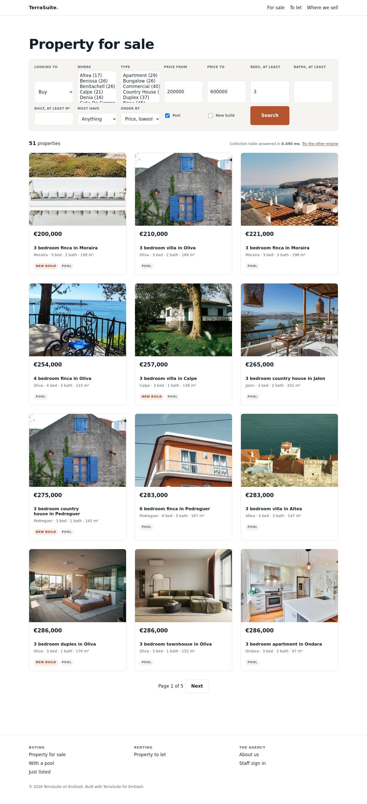

# TerraSuite for EmDash

An estate agency site template for [EmDash](https://emdashcms.com), Cloudflare's
CMS. A property collection, a search that answers the question a buyer actually
asks, and the pages an agency needs on its first day.

Built by [Havenswift Hosting](https://www.havenswift-hosting.co.uk/), who make
TerraSuite for WordPress and have run hosting for United Kingdom businesses
since 2005.

**[Live demo](https://emdash.terrasuite.uk/)** - 420 properties, the real thing
rather than a video.

[](https://emdash.terrasuite.uk/)

## What is in it

| | |
| --- | --- |
| `seed/makeseed.py` | The property collection: 27 fields, a location taxonomy, a menu, and as many sample properties as you ask for |
| `src/pages/index.astro` | Home page: one search, the newest stock, every town |
| `src/pages/search.astro` | Results, with filters that survive a page reload and a shareable URL |
| `src/pages/property/[slug].astro` | A property, read through EmDash's own content API |
| `src/pages/area/[slug].astro` | Everything on the books in one town |
| `src/lib/property-search.ts` | The search itself |
| `scripts/install-indexes.mjs` | The indexes the search needs |

One stylesheet, no framework, no webfont, nothing fetched from another host.
Colour is two custom properties, so rebranding is two lines.

## Getting started

```sh
npm create astro@latest my-agency -- --template havenswift-hosting/terrasuite-emdash
cd my-agency
npm run dev
```

The schema applies on the first request. Then put the search indexes in and
restart:

```sh
node scripts/install-indexes.mjs ./data.db
```

The site is on `http://localhost:4321/` and the admin panel is at
`/_emdash/admin`.

`npm create emdash` cannot fetch this: its template list is four names compiled
into the package, so it only installs Cloudflare's own. Anything that reads a
GitHub repository will do instead, and `create-astro` hands any template
containing a `/` straight to [giget](https://github.com/unjs/giget), so this
works too:

```sh
npx giget@latest gh:havenswift-hosting/terrasuite-emdash my-agency
```

### Sample stock

`seed/seed.json` carries 24 properties across 15 towns, which is enough to see
the search work. For more:

```sh
npm run seed                 # regenerate the seed, any number of properties
node scripts/load-demo-stock.mjs 420   # or load straight into an existing database
```

Photographs are not in the seed. `scripts/load-demo-photos.mjs --from <folder>`
puts a folder of JPEGs into the media library and hands them out by property
type, which is how the demo site above is dressed.

## The search, and why it is not the content API

`getEmDashCollection()` filters by field values or taxonomy terms. It has **no
range operator**, so "between 150,000 and 600,000" and "at least three bedrooms"
cannot be asked at all. A sandboxed plugin's `ctx.storage.query()` has ranges
but only on declared indexes, with one sort, 100 rows a page, and no way to ask
whether a multi-valued field contains a value.

So the search reads the collection table directly, which trusted site code may
do. EmDash has already done the hard part: every collection gets a real SQL
table with a real column per field, which is the same flat index TerraSuite
builds for itself on WordPress.

`/search?engine=api` runs the same page through the content API instead, and
says which filters it had to drop. It is there because the difference is worth
seeing rather than being told about.



## What it costs

Measured on a real installation, ten filters, ordered by price, first page:

| Properties | Median |
| ---------- | ------ |
| 1,000 | 0.015 ms |
| 5,000 | 0.053 ms |
| 20,000 | 0.092 ms |
| 50,000 | 0.226 ms |

Without the indexes in `scripts/install-indexes.mjs` the same search is 4.0 ms
at 20,000, so run it. It takes 291 ms over 50,000 rows.

## What it does not do

No map search in the template. The distance query is in the measurement
scripts and costs 0.097 ms at agency scale, but a map needs tiles, and which
tile source an agency uses is their decision rather than ours.

No photographs in the seed. An agency uploads its own through the media
library; until a property has one, the card draws a placed panel naming the
property type rather than a broken image. `scripts/load-demo-photos.mjs` will
dress a demo with a folder of your own JPEGs.

## Licence

MIT, the same as EmDash.
